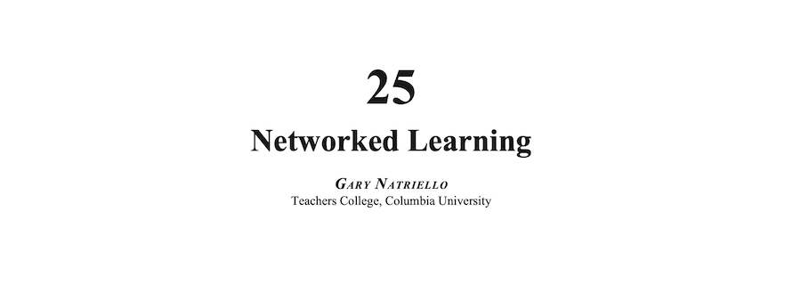
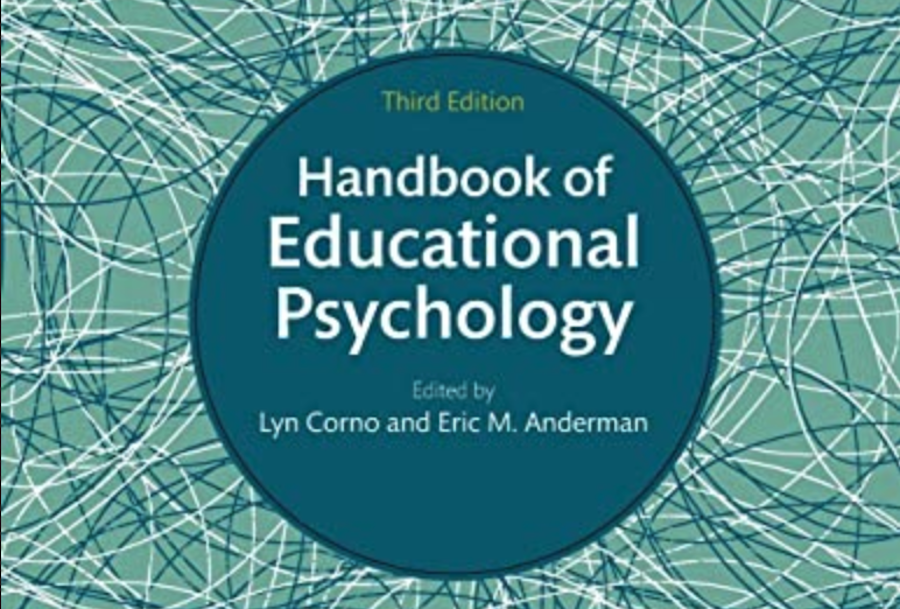
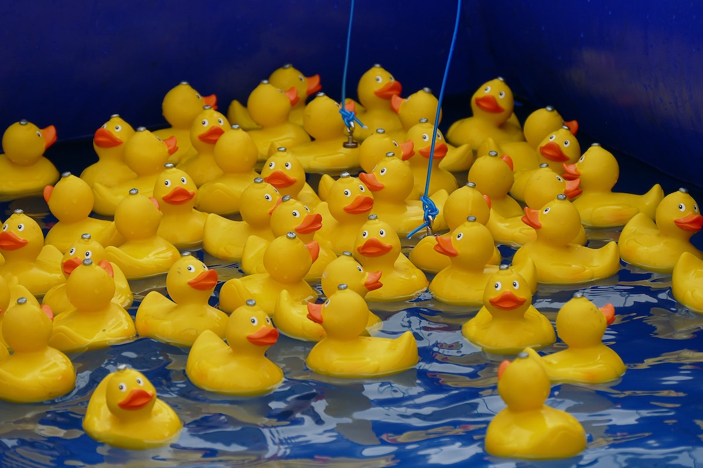
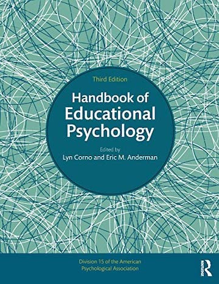
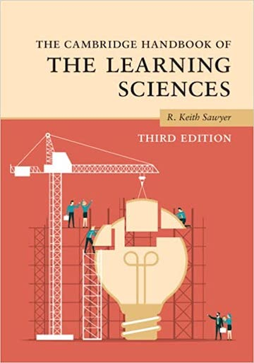
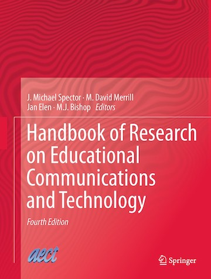
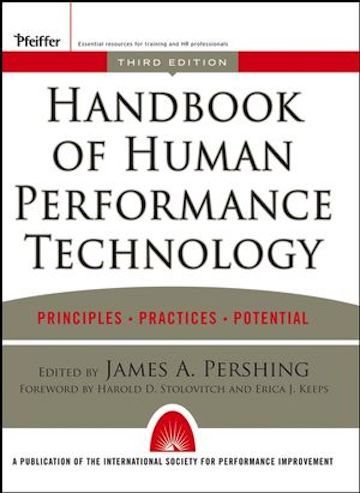
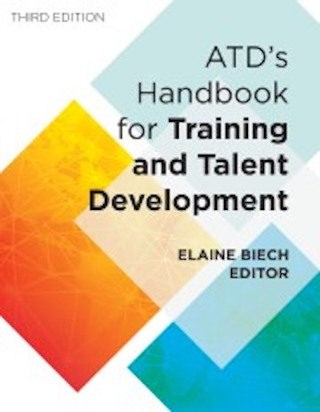
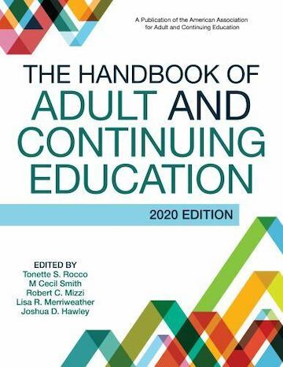

```{r setup, include=FALSE}
usethis::use_git_ignore(c("*.csv", "*.rds"))
options(htmltools.dir.version = FALSE)

library(knitr)
library(tidyverse)
library(xaringan)
library(fontawesome)
```

class: inverse, center, middle

# `r fa("fas fa-images", fill = "#fff")`

**View the slides:** 

[bretsw.com/eme6665-ss23-module3](https://bretsw.com/eme6665-ss23-module3)

---

class: inverse, center, middle

# `r fa("comments", fill = "#fff")` <br><br> Module 2 Discussion <br> Themes

---

# `r fa("comments", fill = "#fff")` Screening

```{r, out.width = "480px", echo = FALSE, fig.align = "center"}

```

--

**Practical screening:** (Fink, 2020)

--

- Publication date: **year > 2018** (within the past 5 years)

--

- Source: Peer-reviewed journal articles, **impact factor > 1** (see FSU Libraries' [Academic Publishing Guide](https://guides.lib.fsu.edu/academicpublishing/citationanalysis))

---

# `r fa("comments", fill = "#fff")` Screening

```{r, out.width = "480px", echo = FALSE, fig.align = "center"}

```

**Methodological screening:** (Fink, 2020)

--

- Population and setting

--

- Date of data collection

--

- Paradigm and methodology

--

- Evidence supporting claims (trustworthiness, validity, reliability)

---

# `r fa("comments", fill = "#fff")` Structuring the Dissertation

```{r, out.width = "640px", echo = FALSE, fig.align = "center"}
include_graphics("img/build.jpg")
```

- Follow the FSU template

--

- Use APA style (citations, formatting, voice, tense)

---

# `r fa("comments", fill = "#fff")` Good Writing

```{r, out.width = "480px", echo = FALSE, fig.align = "center"}

```

--

- Clearly define your concepts

--

- Clearly state the problem, your purpose, and the research questions

--

- Clearly describe your processes for reviewing the literature and selecting your methods

--

- Be consistent (use the same terms and phrases over and over)

---

class: inverse, center, middle

# `r fa("fas fa-book-open", fill = "#fff")` <br><br> Module 3:<br>A Handbook's Tale

---

# `r fa("fas fa-magnifying-glass", fill = "#fff")` Searching the Literature

```{r, out.width = "540px", echo = FALSE, fig.align = "center"}

```

--

1. Databases (FSU library OneSearch: [lib.fsu.edu](https://www.lib.fsu.edu/))

--

2. Systematic Literature Reviews (Module 4)

--

3. Handbook Chapters (Module 3)

---

class: inverse, center, middle

# `r fa("fas fa-book-open", fill = "#fff")` <br><br> Module 3 readings

---

# `r fa("fas fa-book-open", fill = "#fff")` Module 3 readings (3.1)

### Handbook chapter: Natriello, 2016

--

```{r, out.width = "420px", echo = FALSE, fig.align = "center"}

```

<div class="caption">
<p>Handbook of Educational Psychology (3rd ed.), L. Corno & E. M. Anderman (Eds.)</p>
</div>

```{r, out.width = "420px", echo = FALSE, fig.align = "center"}

```

---

# `r fa("fas fa-book-open", fill = "#fff")` Module 3 readings (3.1)

### Handbook chapter: Natriello, 2016

```{r, out.width = "600px", echo = FALSE, fig.align = "center"}

```

<div class="caption">
<p>(Lee & Trace, 2009)</p>
</div>

---

# `r fa("fas fa-book-open", fill = "#fff")` Module 3 readings (3.2)

### Choose-Your-Own-Adventure

```{r, out.width = "100%", echo = FALSE, fig.align = "center"}
include_graphics("img/3-cyoa-books.jpg")
```

---

# `r fa("fas fa-book-open", fill = "#fff")` Module 3 readings (3.2)

### Choose-Your-Own-Adventure

```{r, out.width = "600px", echo = FALSE, fig.align = "center"}
include_graphics("img/choose.jpg")
```

--

- Pick a **handbook chapter** relevant to your research topic

--

- Read **5 articles** cited in the handbook chapter

---

# `r fa("fas fa-book-open", fill = "#fff")` Module 3 readings (3.2)

### Choose-Your-Own-Adventure

```{r, fig.show = "hold", out.width = "20%", echo = FALSE}



```

```{r, fig.show = "hold", out.width = "20%", echo = FALSE}



```

---

class: inverse, center, middle

# `r fa("fas fa-binoculars", fill = "#fff")` <br><br> Looking ahead

---

# `r fa("fas fa-calendar-day", fill = "#fff")` Semester schedule

- Module 1: Threads of Chapter One

- Module 2: Do You Trust Me?

- **Module 3: A Handbook's Tale**

- Module 4: Systematic Not Automatic

- Module 5: Synthesis Over Summary

- Module 6: Elements of Style (for Academic Writing)

- Module 7: Weaving Together Chapter One

---

# `r fa("fas fa-calendar-day", fill = "#fff")` Assignment: Topic Reflection 

--

1. Pick **1** handbook chapter

--

2. Read **5** articles cited in the chapter

--

3. Reflect on how these five studies help you view your dissertation research topic in a new way

--

  - New frameworks, new links between topics, new methods
  
--

4. Compose a brief paper detailing these reflections (**750-1,250 words**)

--

  - Brief summary and comments on trustworthiness of each article

--

<hr>

### Your main objective is **synthesis**: <br><br>

--

### conncting the studies to each other and to your research topic

---

class: inverse, center, middle

# `r fa("fas fa-pen", fill = "#fff")` Drawing the Map

<div class="padlet-embed" style="border:1px solid rgba(0,0,0,0.1);border-radius:2px;box-sizing:border-box;overflow:hidden;position:relative;width:100%;background:#F4F4F4"><p style="padding:0;margin:0"><iframe src="https://fsu.padlet.org/embed/jbwz0hokd7llz8bf" frameborder="0" allow="camera;microphone;geolocation" style="width:100%;height:480px;display:block;padding:0;margin:0"></iframe></p><div style="display:flex;align-items:center;justify-content:end;margin:0;height:28px"><a href="https://padlet.com?ref=embed" style="display:block;flex-grow:0;margin:0;border:none;padding:0;text-decoration:none" target="_blank"><div style="display:flex;align-items:center;"></div></a></div></div>

<div class="caption">
<p><a href="https://rgbstudios.org/projects/dnd-dice" target="_blank">D&D Dice: D6 + D10</a></p>
</div>

---

class: inverse, center, middle

# `r fa("fas fa-question", fill = "#fff")` <br><br> Questions

<hr>

**What questions can I answer for you now?**

**How can I support you this week?**

<hr>

`r fa("envelope", fill = "#fff")` [bret.staudtwillet@fsu.edu](mailto:bret.staudtwillet@fsu.edu) | `r fa("globe", fill = "#fff")` [bretsw.com](https://bretsw.com) | `r fa("fab fa-github", fill = "#fff")` [GitHub](https://github.com/bretsw/)